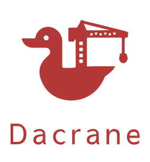

<div style="text-align: center;">
  <p></p>
  <p>Dacrane: A delivery tool for cloud applications</p>
  <p>
    <a href=https://opensource.org/licenses/Apache-2.0>
      
    </a>
    <a href="https://github.com/SIOS-Technology-Inc/dacrane/actions/workflows/unit-test.yaml">
      
    </a>
    <p>
      <a href="https://discord.gg/8nTpyRrmkm">
        
      </a>
    </p>
  </p>
  <p>
    
  </p>
  <p>
    Status: <b>Experimental Version</b> :test_tube:
    (Public Beta coming soon)
  </p>
</div>

---

Dacrane is an open-source tool for integrating container infrastructure, build, release and deployment.

We, developers, don't want to write down deployment procedures and dependencies between our applications and infrastructure in a procedure document.
Such procedures are redundant and out of date.
A lot of time is lost by maintaining and manually testing them.

However, developers only want to deploy and deliver value to their users, and Dacrane answers this need.
By managing deployments with only declarative code and simple commands, developers can focus on delivering value.
The code can be easily replicated for development, staging, production, etc.

Dacrane is currently in the early stages of development.
**Please support this project with your Github Star!**

## Delivery as Code (DaC)

Delivery as Code (DaC) is a term coined to describe the use of declarative code to deploy from infrastructure to application.

Traditionally, developers must deploy applications using different tools for each layer of infrastructure, OS, middleware, and application, with numerous configuration files, CLIs, and GUIs to maintain exact consistency.

The idea behind DaC is to manage and automate these processes with integrated code to manage and automate the deployment process, thereby reducing costs and the risk of operational errors.
This allows for safe and fast development.
Therefore, the idea of DaC is highly compatible with continuous, fast-cycle development such as DevOps, agile development, and microservices architecture.

DaC is similar in concept to IaC, but DaC includes build-release-deploy at the application layer as well as the infrastructure.

Dacrane is one of the DaC tools in container technology.


<div style="text-align: center;">DaC Positioning</div>

## Features

Dacrane has the following features

- A single code for container infrastructure, build, release, and deployment
- Support for many container execution environments, from local Docker to CaaS in the Cloud
- Pluggable design for easy scalability
- Automatic template generation
- Support for collaboration among operators
- Integration of multiple repositories
- Isolation of environments such as local, test, staging, production, etc.
- Manage change history

## Install

Install [Docker Engine](https://docs.docker.com/engine/install/).

```bash
$ docker version
```

Make sure that DOCKER ENDPOINT is `unix:///var/run/docker.sock`.
(If not, create a symbolic link from `/var/run/docker.sock` to `/your/path/to/docker.sock`.)

```bash
$ docker context ls
NAME        DESCRIPTION                               DOCKER ENDPOINT               ERROR
default *   Current DOCKER_HOST based configuration   unix:///var/run/docker.sock
```

Clone Dacrane repository.

```bash
$ git clone https://github.com/SIOS-Technology-Inc/dacrane.git
$ cd dacrane
```

Install Dacrane.

```bash
$ make install
$ make install-plugins
```

Make sure Dacrane CLI.

```bash
$ dacrane

Usage:
  dacrane [command]
...
```

Uninstall Dacrane.

```bash
$ make uninstall-plugins
$ make uninstall
```

## Try Dacrane Samples!

* [Azure App Service Example](./example/app-services/README.md)

## License

[Apache License 2.0](./LICENSE)
