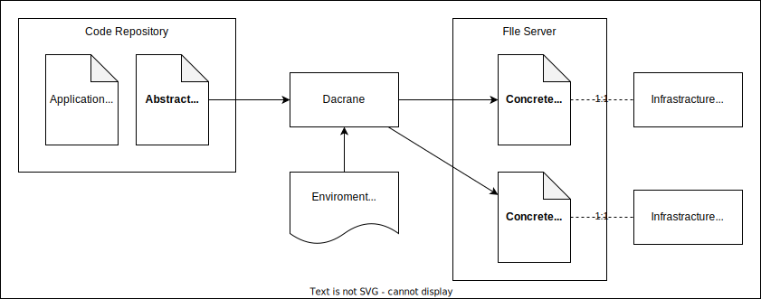

# Architecture

Dacrane is used via the CLI, which provides the developer with many of the commands needed for deployment.

The actual deployment process is performed on the Docker container.
This allows developers to run the deployment process in the same way they always do.
Plug-ins are also containers and include all necessary middleware, etc.
Only the Dacrane CLI and Docker need to be installed to get started with Dacrane.

Logs, status data, and sensitive information are stored in cloud storage.
This allows multiple developers to collaborate.
Data can also be stored on a local PC for smaller development efforts.

The plugin is intended to be published as a container image on DockerHub or other sites.
The container image to be used is specified in the deployment code.
Plug-ins can be implemented according to a process defined by a common interface (gRPC).

Templates can be published in a code repository and copied to the local environment from the CLI.
Developers can modify and use the copied code.


A typical Dacrane environment build process proceeds as follows:

1. the developer orders Dacrane to launch the environment
2. Dacrane creates a Job on Docker.
3. The Job analyzes resource and artifact dependencies and determines the order of execution.
4. Job calls the necessary artifact plugins. Containers are launched using DooD.
5. The artifact plugin stores build artifacts in the repository.
6. Similarly, Job calls the necessary resource plugins.
7. resource plugins perform infrastructure and application deployment.
8. Users will be able to make requests to the built application.

# Data Design

## Abstract/Concrete Deployment Code (ADC/CDC)

To meet the requirement of an easily replicable environment, Dacrane uses two types of codes: abstract deployment code (ADC) and concrete deployment code (CDC).

The ADC is a configuration definition that is separate from the infrastructure and application entities and contains information such as what infrastructure the application will be deployed to.
On the other hand, a CDC is a configuration definition that corresponds to the actual infrastructure and application.

The ADC is committed and managed in a code repository, while the CDC is managed on a separate file server (such as a local PC file system or AWS S3).
This allows for separation of per-environment deployment settings from the repository, eliminating the need to maintain environment-related files such as local.yaml, stg.yaml, prd.yaml, etc.

For example, ADC defines that the application will be deployed to App Services, but does not specifically specify Azure tenants or resource groups. These values are defined separately as environment variables.



# Specification

## Context

```bash
$ dacrane show context
```

```bash
$ dacrane create context [context_name] \
  [--storage (local|aws_s3|azure_blob_storage|...)] \
  [--vault (local|aws_secrets_manager|azure_key_vault|...)]
```

```bash
$ dacrane switch context [context_name]
```

```bash
$ dacrane delete context [context_name]
```

## Context Login

```bash
$ dacrane login [-c context_name] [storage|vault] \
  [credentials]...
```

```bash
$ dacrane logout [-c context_name] [storage|vault]
```

## Deployment Code

```yaml
kind: resource
name: resource_name
provider: resource_provider_name
parameters:
  a: 1
  b: "string"
  c: true
  d: null
  e: ${ expression }
```

```yaml
kind: artifact
name: artifact_name
provider: artifact_provider_name
parameters:
  a: 1
  b: "string"
  c: true
  d: null
  e: ${ expression }
```

```yaml
kind: data
name: data_name
provider: data_provider_name
parameters:
  a: "abc"
  b: ${ env.ENVNAME }
```

## Expression

```yaml
parameters:
  a: ${ env.ENV_NAME }
```


```
# TOKEN
NUMBER     ::= [0-9]+\.[0-9]+
STRING     ::= ".*"
BOOLEAN    ::= ("true"|"false")
NULL       ::= "null"
IDENTIFIER ::= [a-zA-Z0-9_-]+
DOT        ::= "."
COMMA      ::= ","
COLON      ::= ":"
AND        ::= "&&"
OR         ::= "||"
NOT        ::= "!"
EQ         ::= "=="
LT         ::= "<"
LTE        ::= "<="
GT         ::= ">"
GTE        ::= ">="
ADD        ::= "+"
SUB        ::= "-"
MUL        ::= "*"
DIV        ::= "/"
LBRACKET   ::= "("
RBRACKET   ::= ")"
LSBRACKET  ::= "[" # square brackets
RSBRACKET  ::= "]" # square brackets
LCBRACKET  ::= "{" # curly brackets
RCBRACKET  ::= "}" # curly brackets
IF         ::= "if"
THEN       ::= "then"
ELSE       ::= "else"

# SYNTAX

EXPR
  ::= NUMBER
    | STRING
    | BOOLEAN
    | NULL
    | LBRACKET EXPR RBRACKET
    | EXPR AND EXPR
    | EXPR OR EXPR
    | NOT EXPR
    | EXPR EQ EXPR
    | EXPR LT EXPR
    | EXPR LTE EXPR
    | EXPR GT EXPR
    | EXPR GTE EXPR
    | EXPR ADD EXPR
    | EXPR SUB EXPR
    | EXPR MUL EXPR
    | EXPR DIV EXPR
    | REF
    | APP
    | LIST
    | MAP
    | IF_EXPR

IF_EXPR ::= IF EXPR THEN EXPR ELSE EXPR

APP ::= IDENTIFIER LBRACKET PARAMS RBRACKET
PARAMS
  ::= PARAMS COMMA PARAMS
    | EXPR
    | (nothing)

LIST ::= LSBRACKET ITEMS RSBRACKET
ITEMS
  ::= ITEMS COMMA ITEMS
    | EXPR
    | (nothing)

MAP ::= LCBRACKET KVS RCBRACKET
KVS
  ::= KVS COMMA KVS
    | STRING COLON EXPR
    | (nothing)

REF
  ::= REF DOT REF
    | IDENTIFIER
```

## Control Flow

```yaml
kind: resource
if: ${ env.local } # bool expression
name: resource_name
provider: provider_name
parameters:
  a: "string"
```

```yaml
kind: resource
for: ${ ["a", "b", "c"] }          # array expression
name: resource_name_${ for.value } # unique name
provider: provider_name
parameters:
  name: name-${ for.value }
```

## Environment Configuration

```bash
$ dacrane set env [-f env_file_name] [-c context_name]
```

```yaml
# .env-stg.yaml

```

```bash
$ dacrane unset env [-c env_name]
```


## Environment

```bash
$ dacrane create context [environment]
```

```bash
$ dacrane switch context [environment]
```

```bash
$ dacrane delete context [environment]
```

## Up & Down

```bash
$ dacrane up
```

```bash
$ dacrane down
```

## resource

```bash
$ dacrane deploy [resource]
```

```bash
$ dacrane destroy [resource]
```

## artifact

```bash
$ dacrane build [artifact] -t [version]
```

```bash
$ dacrane publish [artifact] -t [version]
```

```bash
$ dacrane list [artifact]

1.0.0 1.0.1
1.1.0 1.2.1

2.0.0
2.1.0
```

```bash
$ dacrane delete [artifact] -v [version]
```
