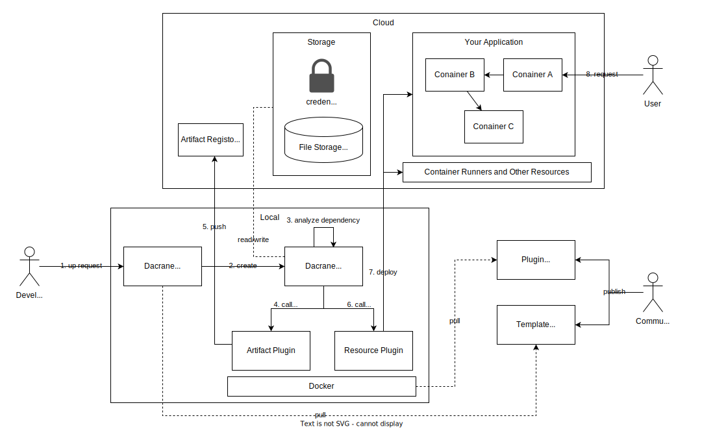
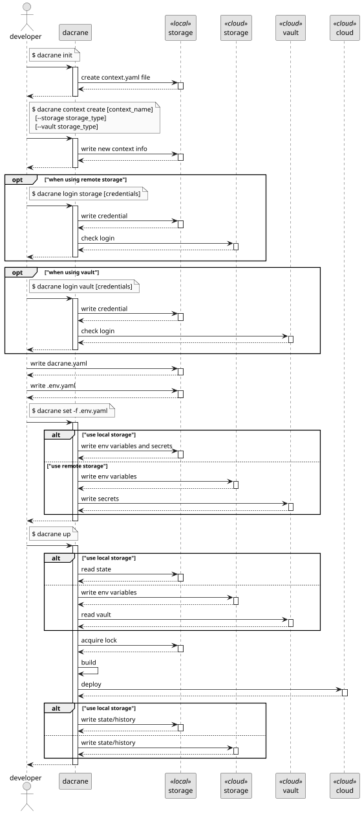

- [Architecture](#architecture)
- [Data Design](#data-design)
  - [Abstract/Concrete Deployment Code (ADC/CDC)](#abstractconcrete-deployment-code-adccdc)
- [Specification](#specification)
  - [Deployment Code](#deployment-code)
    - [Module](#module)
      - [Name section](#name-section)
      - [Import section](#import-section)
      - [Parameter section](#parameter-section)
      - [Dependencies section](#dependencies-section)
      - [Modules section](#modules-section)
    - [Expression](#expression)
      - [Syntax](#syntax)
      - [Fixture Variables](#fixture-variables)
      - [Expansion](#expansion)
        - [String Expansion](#string-expansion)
        - [Object Expansion](#object-expansion)
    - [Control Flow](#control-flow)
      - [if key](#if-key)
      - [for key](#for-key)
  - [Command](#command)
    - [init](#init)
    - [apply](#apply)
    - [destroy](#destroy)
    - [ls](#ls)
    - [tree](#tree)
- [Flow](#flow)

# Architecture

Dacrane is used via the CLI, which provides the developer with many of the commands needed for deployment.

The actual deployment process is performed on the Docker container.
This allows developers to run the deployment process in the same way they always do.
Plug-ins are also containers and include all necessary middleware, etc.
Only the Dacrane CLI and Docker need to be installed to get started with Dacrane.

Logs, status data, and sensitive information are stored in cloud storage.
This allows multiple developers to collaborate.
Data can also be stored on a local PC for smaller development efforts.

The plugin is intended to be published as a container image on DockerHub or other sites.
The container image to be used is specified in the deployment code.
Plug-ins can be implemented according to a process defined by a common interface (gRPC).

Templates can be published in a code repository and copied to the local environment from the CLI.
Developers can modify and use the copied code.



A typical Dacrane environment build process proceeds as follows:

1. the developer orders Dacrane to launch the environment
2. Dacrane creates a Job on Docker.
3. The Job analyzes resource and artifact dependencies and determines the order of execution.
4. Job calls the necessary artifact plugins. Containers are launched using DooD.
5. The artifact plugin stores build artifacts in the repository.
6. Similarly, Job calls the necessary resource plugins.
7. resource plugins perform infrastructure and application deployment.
8. Users will be able to make requests to the built application.

# Data Design

## Abstract/Concrete Deployment Code (ADC/CDC)

To meet the requirement of an easily replicable environment, Dacrane uses two types of codes: abstract deployment code (ADC) and concrete deployment code (CDC).

The ADC is a configuration definition that is separate from the infrastructure and application entities and contains information such as what infrastructure the application will be deployed to.
On the other hand, a CDC is a configuration definition that corresponds to the actual infrastructure and application.

The ADC is committed and managed in a code repository, while the CDC is managed on a separate file server (such as a local PC file system or AWS S3).
This allows for separation of per-environment deployment settings from the repository, eliminating the need to maintain environment-related files such as local.yaml, stg.yaml, prd.yaml, etc.

For example, ADC defines that the application will be deployed to App Services, but does not specifically specify Azure tenants or resource groups. These values are defined separately as environment variables.


# Specification

## Deployment Code

Deployment code is the [YAML](https://yaml.org/spec/) code that defines the Dacrane deployment.
The code is structured in units called "modules".
Expressions can also be written as YAML strings.

### Module

YAML code is described as one module per document. (Not one module per file.)
A module represents a unit of deployment.
A module can be concretized by taking arguments and can deploy instances of infrastructure or applications.
Modules can be called from the dacrane apply command and from another module.

Modules are provided by default, but can also be created by the external community or by the user to create their own.

The module consists of the following sections

|  section  | description |
| -- | -- |
| name  | Module name. |
| import | Import external deployment code.　|
| parameter | Parameter schema. |
| dependencies | List of dependent modules. |
| modules | List of module calls. |

```yaml
name:

import:

parameter:

dependencies:

modules:
```

#### Name section

The Name section specifies the name of this module.

The restrictions are as follows

* Names must not conflict with modules to be imported in the file and in the import section.
* Expression cannot be used.

The format is as follows

| key | type | description |
| -- | -- | -- |
| name | string | The module name. |

```yaml
name: [string]
```

For example

```yaml
name: foo
```

#### Import section

The import section is used to load external deployment code.
Import of local files or external files via HTTP is possible.

The restrictions are as follows

* Module names must be imported so that they do not conflict.
* Expression cannot be used.

The format is as follows

| key | type | description |
| -- | -- | -- |
| import | list(string) | The path or URL string list to the local file. |

```yaml
import:
- [string]
```

For example

```yaml
import:
- ./local_modules.yaml
- https://example.com/dacrane.yaml
```

#### Parameter section

The Parameter section defines the data types of parameters for the module.
[YAML is upward compatible with JSON](https://yaml.org/spec/1.2.2/#102-json-schema), and parameter types are defined as [JSON Schema](https://json-schema.org/specification).
The defined parameters can be referenced by expressions from the Modules section.

The restrictions are as follows

* Expression cannot be used.

The format is as follows

| key | type | description |
| -- | -- | -- |
| parameter | object | Definition of parameter types. Defined in [JSON Schema](https://json-schema.org/specification). |

```yaml
parameter: [json_schema]
```

For example

```yaml
parameter:
  type: object
  properties:
    a: { type: number }
    b: { type: string, default: latest }
```

#### Dependencies section

The Dependencies section defines the modules on which this module depends. The instance for a module is determined at runtime.

The restrictions are as follows

* Expression cannot be used.

The format is as follows

| key | type | description |
| -- | -- | -- |
| dependencies | list(object) | The module list which it depends on. |
| dependencies.*.name | string | The name of the module locally. It can be referenced from an expression. |
| dependencies.*.module | string | The name of the module on which it depends. |

```yaml
dependencies:
- name: [string]
  module: [string]
```

For example

```yaml
dependencies:
- name: a
  module: foo
- name: b
  module: bar
```

#### Modules section

The Modules section defines a series of modules to be managed.

The restrictions are as follows

* Do not have circular references between modules.

The format is as follows

| key | type | description |
| -- | -- | -- |
| modules | list(object) | The module list that it manages. |
| modules.*.name | string | The name of the module locally. It can be referenced from an expression. |
| modules.*.depends_on | list(string) | The name of the local module on which it depends. When referenced by an expression, it is considered dependent even if it is not listed here. |
| modules.*.module | string | The module name that it calls. You can specify the imported module or provider name: `data/[provider_name]` for a data provider or `resource/[provider_name]` for a resource provider. |
| modules.*.argument | string | Actual arguments to be passed to the calling module. |

```yaml
modules:
- name: [string]
  depends_on: [list(string)]
  module: [string]
  argument: [object]
```

For example

```yaml
modules:
- name: foo
  depends_on:
    - bar
  module: resource/baz
  argument:
    a: 123
    b: abc
- name: bar
  module: resource/qux
  argument:
    a: 123
    b: abc
```

### Expression

Expressions can be written in YAML strings enclosed in `${{` and `}}`.

For example

```yaml
${{ 1 + 1 }} # evaluates to 2.
```

#### Syntax

The BNF is shown below.

```
# TOKEN
NUMBER     ::= [0-9]+\.[0-9]+
STRING     ::= ".*"
BOOLEAN    ::= ("true"|"false")
NULL       ::= "null"
IDENTIFIER ::= [a-zA-Z0-9_-]+
DOT        ::= "."
COMMA      ::= ","
COLON      ::= ":"
AND        ::= "&&"
OR         ::= "||"
NOT        ::= "!"
EQ         ::= "=="
LT         ::= "<"
LTE        ::= "<="
GT         ::= ">"
GTE        ::= ">="
PRIORITY   ::= ">>"
ADD        ::= "+"
SUB        ::= "-"
MUL        ::= "*"
DIV        ::= "/"
LBRACKET   ::= "("
RBRACKET   ::= ")"
LSBRACKET  ::= "[" # square brackets
RSBRACKET  ::= "]" # square brackets
LCBRACKET  ::= "{" # curly brackets
RCBRACKET  ::= "}" # curly brackets
IF         ::= "if"
THEN       ::= "then"
ELSE       ::= "else"

# SYNTAX

EXPR
  ::= NUMBER
    | STRING
    | BOOLEAN
    | NULL
    | LBRACKET EXPR RBRACKET
    | EXPR AND EXPR          (left)
    | EXPR OR EXPR           (left)
    | NOT EXPR               (right)
    | EXPR EQ EXPR           (left)
    | EXPR LT EXPR           (left)
    | EXPR LTE EXPR          (left)
    | EXPR GT EXPR           (left)
    | EXPR GTE EXPR          (left)
    | EXPR PRIORITY EXPR     (left)
    | EXPR ADD EXPR          (left)
    | EXPR SUB EXPR          (left)
    | EXPR MUL EXPR          (left)
    | EXPR DIV EXPR          (left)
    | SUB EXPR               (right)
    | REF
    | APP
    | LIST
    | MAP
    | IF_EXPR

IF_EXPR ::= IF EXPR THEN EXPR ELSE EXPR

APP ::= IDENTIFIER LBRACKET PARAMS RBRACKET
PARAMS
  ::= PARAMS COMMA PARAMS
    | EXPR
    | (nothing)

LIST ::= LSBRACKET ITEMS RSBRACKET
ITEMS
  ::= ITEMS COMMA ITEMS (left)
    | EXPR
    | (nothing)

MAP ::= LCBRACKET KVS RCBRACKET
KVS
  ::= KVS COMMA KVS (left)
    | STRING COLON EXPR
    | (nothing)

REF
  ::= REF DOT REF (left)
    | IDENTIFIER
```

#### Fixture Variables

| name |  |
| -- | -- |
| parameter | object |
| module | object |

```yaml
${{ parameter.a }}
${{ module.foo }}
```

#### Expansion

Expressions are evaluated and expanded to become YAML concrete data.
There are two types of expression expansion.

* String Expand
* Object Expand

##### String Expansion

If an expression is written within a string, it is combined with the preceding and following strings.
The result of expression evaluation must always be a string.

```yaml
'abc${{ "def" }}ghi' # evaluates to "abcdefghi".
```

##### Object Expansion

For strings consisting only of expressions, the evaluated value is expanded as is.

```yaml
# boolean expand
if: '${{ 1 < 2 }}'
# is the same as
if: true

# object expand
argument: '${{ { "a": 1, "b": 2 } }}'
# is the same as
argument:
  a: 1
  b: 2
```

### Control Flow

By using a meta key for flow control, the Meta keys can only be used in modules.

#### if key

`if` key controls the existence of a YAML key-value; if `if` evaluates to `true`, the object is specified; `if` evaluates to `false`, the object is deleted.
Note that if `if` evaluates to `false`, the expression for that object is not evaluated.

```yaml
argument:
  a: 1
  b:
    if: ${{ parameter.enable }}
    c: 123
    d: abc

# is the same as (parameter.enable == true)
argument:
  a: 1
  b:
    c: 123
    d: abc

# is the same as (parameter.enable == false)
argument:
  a: 1
```

#### for key

`for` key generates an array of objects for each given array.
for key can only be used within an array of objects.

```yaml
argument:
  nodes:
    - for: ["a", "b", "c"]
      name: node-${{ for.element }}
      zone: ${{ for.element }}
      version: v1.0.0

# is the same as
argument:
  nodes:
    - name: node-a
      zone: a
      version: v1.0.0
    - name: node-b
      zone: b
      version: v1.0.0
    - name: node-c
      zone: c
      version: v1.0.0
```

## Command

### init


```bash
$ dacrane init
```

### apply

```bash
$ dacrane apply -a [argument] -d [dependencies] [module] [instance_name]
```

### destroy

```bash
$ dacrane destroy [instance]
```

### ls

```bash
$ dacrane ls [instance]
```

### tree

```bash
$ dacrane tree [instance]
```


# Flow


